# Krishi-Aarogya-ML
🚜 One-stop AI platform for farmers — predicts crop diseases using satellite & environmental data, verifies through CNN + agronomist feedback, and offers multilingual crop management & product recommendations.

# 🌾 Krishi Aarogya — Smart India Hackathon Finalist 2024

### 🚜 One-Stop AI Platform for Farmers

Krishi Aarogya is an **AI-driven, multilingual AgriTech platform** that provides a one-stop solution for every farmer’s need — from disease prediction to detection and complete crop management — all in just one click.

---

## 🌱 Problem Statement

Farmers often face challenges in **early identification and management of crop diseases**, leading to productivity loss and financial stress.  
**Krishi Aarogya** bridges this gap by combining **Machine Learning, environmental data, and satellite imagery** to help farmers prevent and manage diseases efficiently.

---

## ⚙️ Project Overview

The system operates in **three intelligent phases** to deliver end-to-end support:

### 🛰️ Phase 1 — Disease Prediction (Prevention)
- Utilizes **environmental factors and satellite imagery** to predict potential crop diseases before they occur.  
- Alerts farmers about possible risks and suggests preventive actions.  

### 🔍 Phase 2 — Disease Detection (Two-Step Verification)
- Farmers can **upload images of affected crops** through the application.  
- A **CNN-based ML model** performs the initial detection and predicts the most probable disease.  
- The prediction is then **verified by an agronomist** to ensure **high diagnostic accuracy**, preventing wrong treatments that could further harm the crop.  

### 🧺 Phase 3 — Crop Management & Consultation
- Farmers can **purchase fertilizers or pesticides** directly through the platform.  
- Integrated with **Google Maps API** to locate nearby stores.  
- Enables **consultation with agronomists** for expert advice.  
- Includes **multilingual support** to reach farmers in their local languages.

---

## 🧠 My Role — *Machine Learning Lead*
- Designed and trained **CNN models** using TensorFlow and Keras for image-based crop disease detection.  
- Integrated **environmental and satellite data** for predictive analysis using XGBoost.  
- Built **data preprocessing pipelines** and APIs for communication between ML and backend.  
- Collaborated with 5 teammates for full-stack integration and testing.

---

## 🛠️ Tech Stack

| Category | Technologies |
|-----------|---------------|
| **Machine Learning** | TensorFlow, Keras, XGBoost, NumPy, Pandas |
| **Backend** | Flask, REST API |
| **Frontend** | ReactJS, NodeJS, Express |
| **Database** | MongoDB |
| **APIs & Tools** | Google Maps API, Postman, Git, GitHub |
| **Deployment (Future)** | Render / Vercel / MongoDB Atlas |

---

## 🏆 Achievements
- 🥇 **Smart India Hackathon 2024 Finalist**  
- 🥈 **Runner-up – Anveshna Prototype Competition 2024**  
- 🌿 Recognized for innovation in **AI-powered agriculture**  
- 🤝 Successfully integrated ML, web technologies, and real-world agricultural use cases  
- 🌦️ Implemented **real-time weather-integrated forecasting** for accurate disease prediction  
- 📱 Developed a **mobile app version** for seamless on-field accessibility by farmers  
  
---

## 🖼️ Screenshots

### 🌱 Home Page
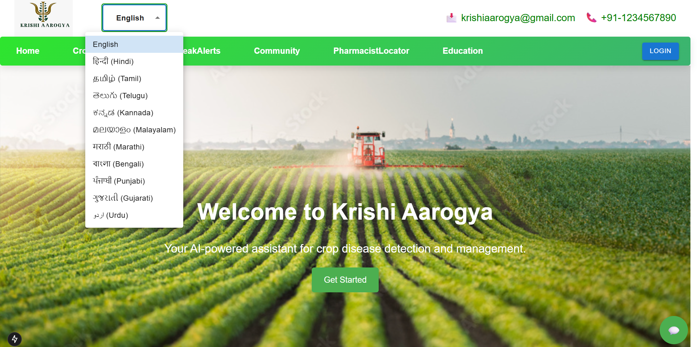

---

### ☀️ Prediction Page
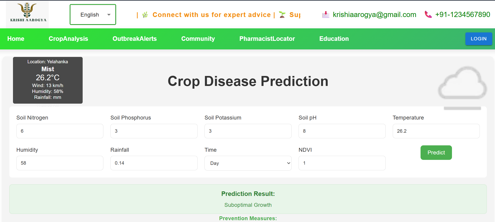

---

### 🔍 Disease Detection (Two-Step Verification) Step-1
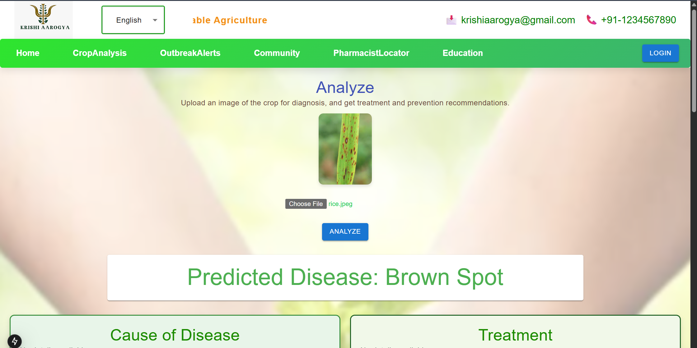
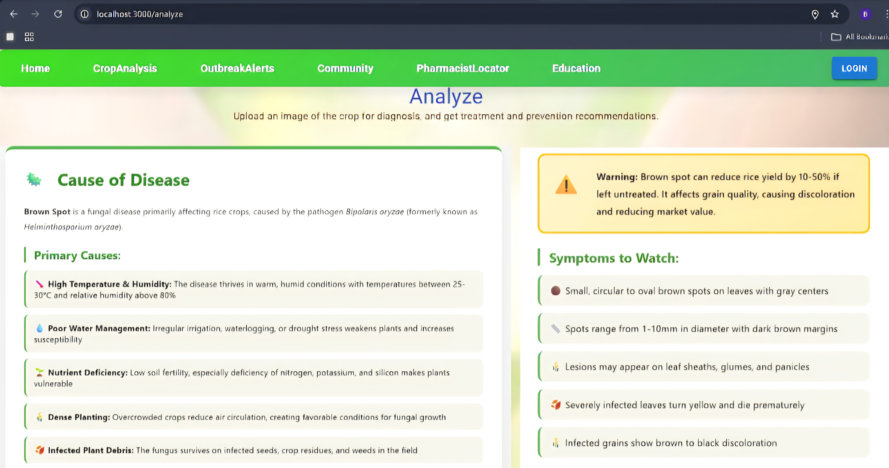

---

### 👨‍🌾 Agronomist Consultation (Step-2)
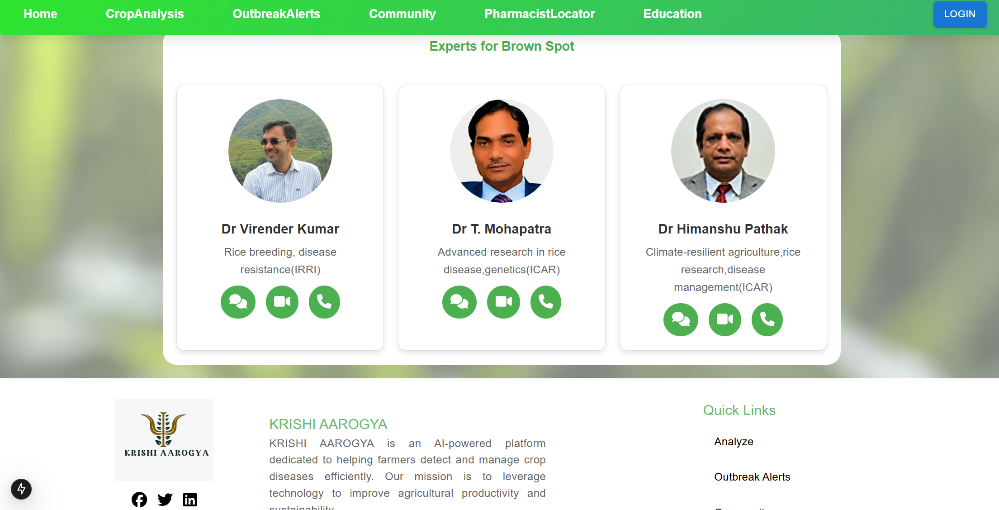

---

### 📍 Locator Feature (Nearby Fertilizer/Pesticide Shops)
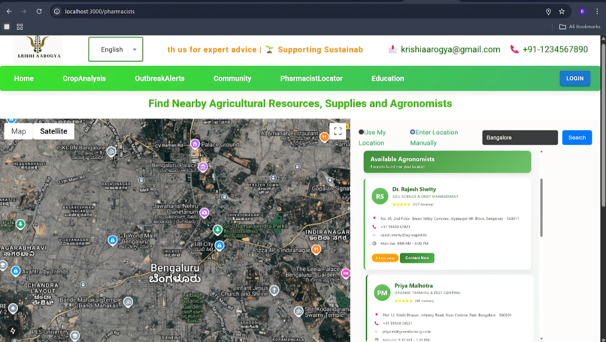

---

### 🧭 Crop Management Dashboard
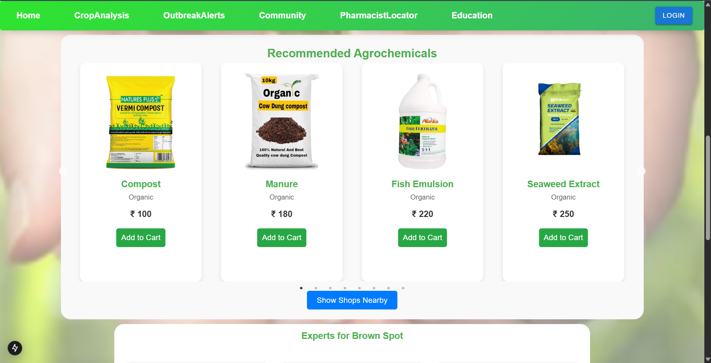

---

### 🌾 Disease Causes
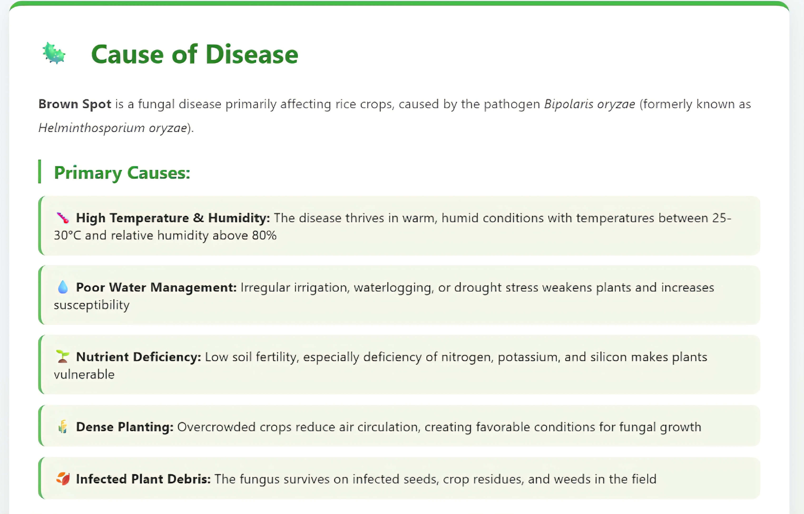

---

### 💊 Treatment Recommendations
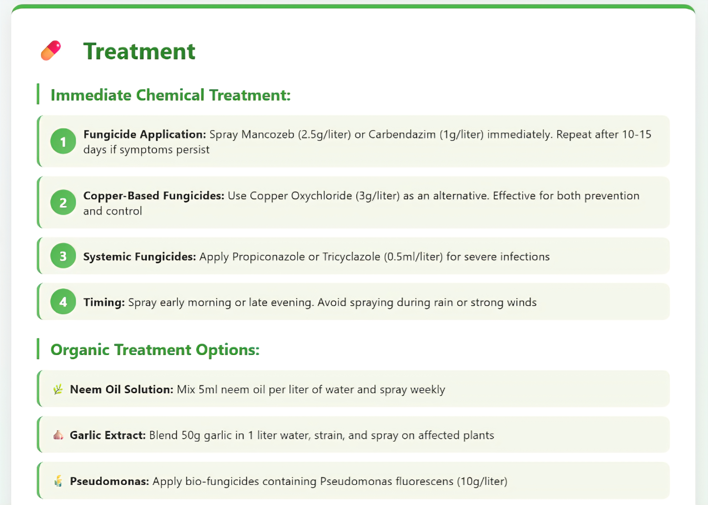

---

### ⚠️ Disease Symptoms
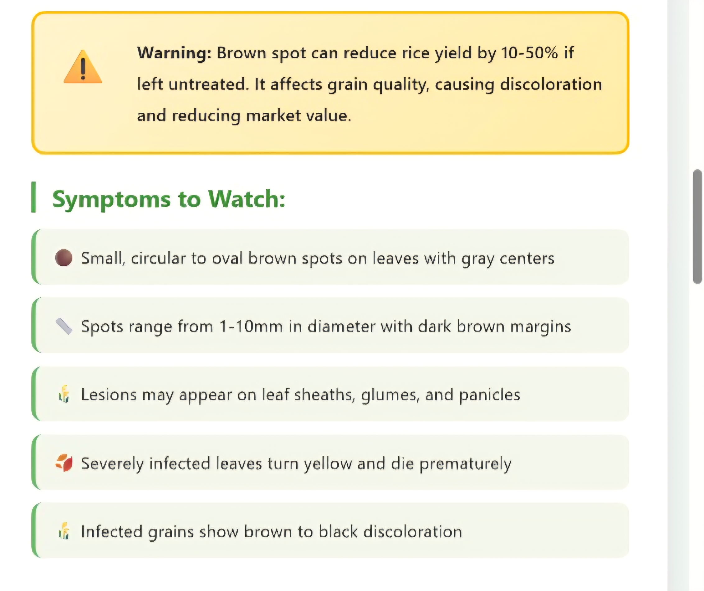

---

### 🌿 Organic Treatment Options
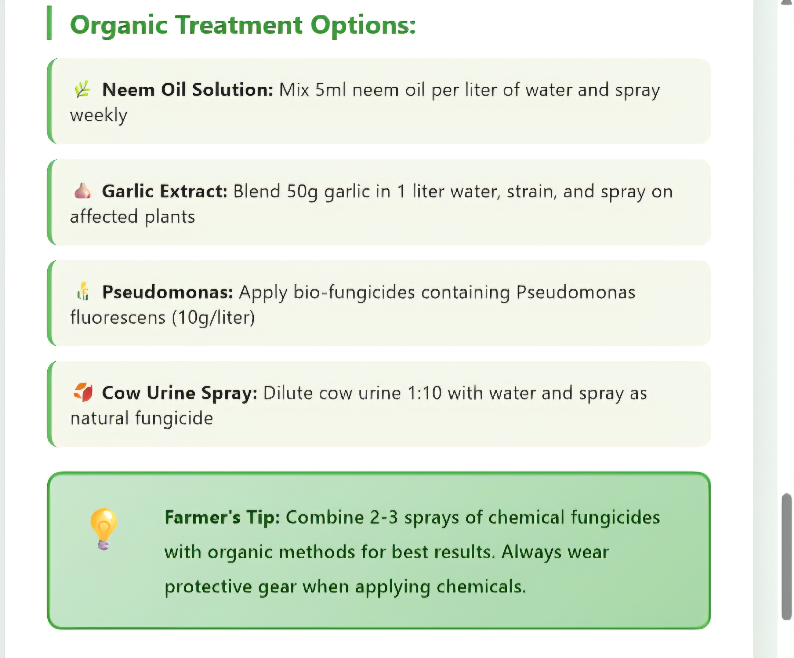

🎥 **Demo Video:** *([Google Drive Link](https://drive.google.com/file/d/1gEQHj30UwEljCkd8rE2pufuAUUi5ddAG/view?usp=drivesdk))*

---
## 🌐 Future Enhancements
- 🗣️ **Voice-based multilingual support** to make the platform more inclusive for farmers across regions  
- 🔄 **Offline functionality** for uninterrupted access in low-connectivity rural areas  
- ☁️ **Cloud deployment** for scalable, real-time data processing and large-scale usage  
  

---
## 📎 Links
- 🔗 **Team Repository (Private):** [GitHub Link](https://github.com/AjayRauniyar/Krishi-Aarogya)
- 👩‍💻 **My GitHub Profile:** [Bhumi Jain](https://github.com/bhumi-jain)

---

⭐ *Developed with passion and purpose by Team Krishi Aarogya.*  
*ML Module led by [Bhumi Jain](https://github.com/bhumi-jain)*  

